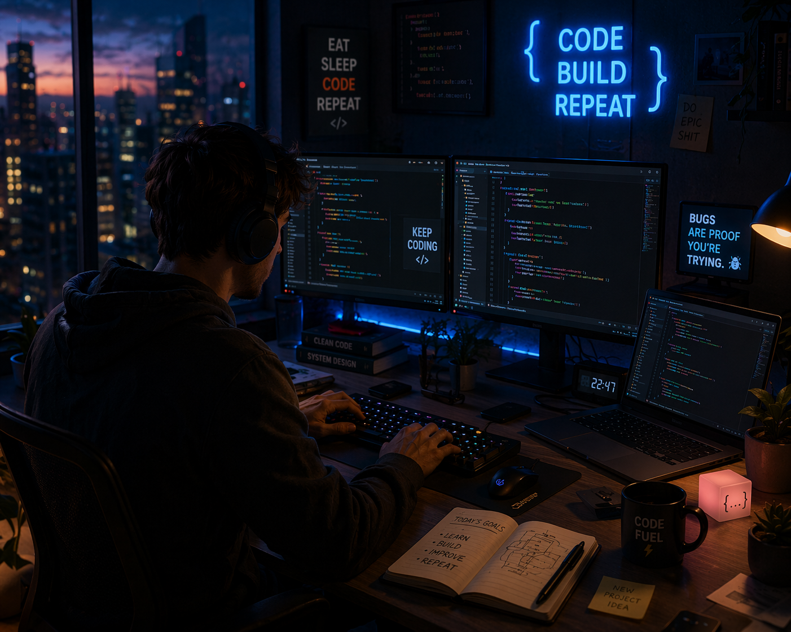

  

<h1 align="center">Hi, I'm Dejan Racic 👋</h1>

  <strong>Junior Frontend Developer in Training · JavaScript · DevSecOps Fundamentals</strong>

  Based in Schwaz, Austria · Building responsive and accessible web applications

---

## About Me

I am training in software development with a focus on frontend technologies and DevSecOps fundamentals. I enjoy turning ideas into clean, responsive applications and continuously improving the structure, usability and security of my projects.

My current work focuses on practical projects using vanilla JavaScript, REST APIs, responsive design and Git-based workflows.

## Featured Projects

### [Pokédex](https://github.com/DejanRacic/Pokedex)

Responsive Pokédex powered by PokéAPI with search, caching, lazy-loaded evolution data, detailed statistics and accessible dialog navigation.

**Technologies:** HTML, CSS, JavaScript, REST API

### [BestellApp](https://github.com/DejanRacic/BestellApp)

Responsive food-ordering application with dynamically rendered meals, category filters and an interactive shopping basket.

**Technologies:** HTML, CSS, JavaScript

### [Fotogram](https://github.com/DejanRacic/Fotogram)

Responsive photo gallery with search, image upload, dark mode and an optimized gallery experience.

**Technologies:** HTML, CSS, JavaScript

### [Quizapp Dark](https://github.com/DejanRacic/Quizapp-Dark)

Interactive quiz application with progress tracking, sound effects and a complete result screen.

**Technologies:** HTML, CSS, JavaScript

## Tech Stack

  
  
  
  
  
  

- Semantic HTML and accessible interfaces
- Responsive layouts and media queries
- Vanilla JavaScript and DOM manipulation
- Fetch API, REST APIs and asynchronous workflows
- Git, GitHub and structured project workflows
- DevSecOps and web security fundamentals

## Current Focus

- Strengthening my JavaScript skills
- Building maintainable frontend applications
- Improving accessibility and responsive design
- Learning secure development and DevSecOps practices
- Preparing for a junior frontend development role

## GitHub Activity

  <picture>
    <source media="(prefers-color-scheme: dark)" srcset="https://raw.githubusercontent.com/DejanRacic/DejanRacic/output/github-contribution-grid-snake-dark.svg">
    <source media="(prefers-color-scheme: light)" srcset="https://raw.githubusercontent.com/DejanRacic/DejanRacic/output/github-contribution-grid-snake.svg">
    
  </picture>

---

  <em>Focused on consistent progress, practical experience and clean code.</em>

